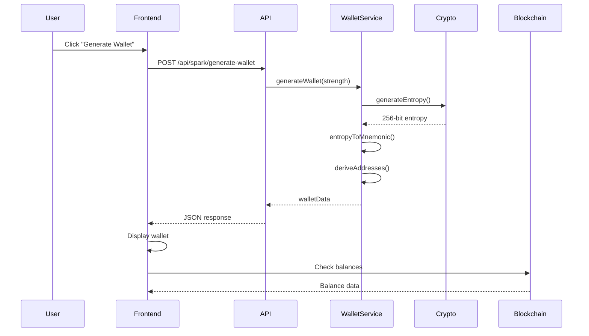
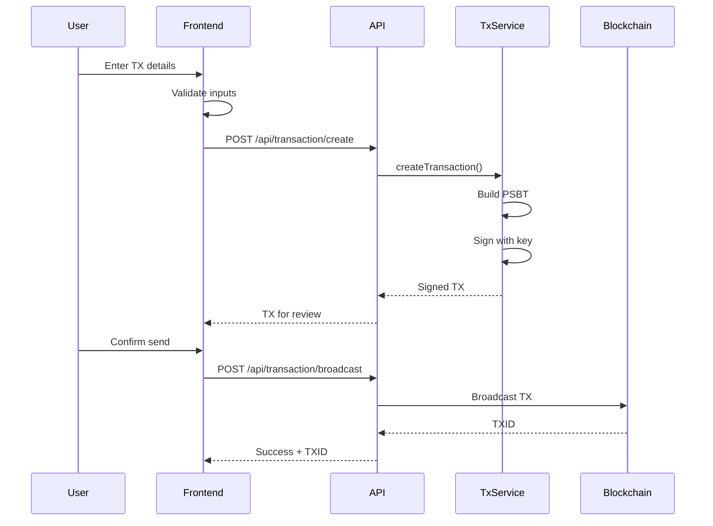

# 🏗️ MOOSH Wallet - Complete Architecture Blueprint
## The Definitive Technical Blueprint for AI-Powered Development

### 📋 Table of Contents
1. [System Architecture Overview](#system-architecture-overview)
2. [Component Architecture](#component-architecture)
3. [Data Flow Architecture](#data-flow-architecture)
4. [Security Architecture](#security-architecture)
5. [API Architecture](#api-architecture)
6. [Frontend Architecture](#frontend-architecture)
7. [Blockchain Integration Architecture](#blockchain-integration-architecture)
8. [Deployment Architecture](#deployment-architecture)
9. [Testing Architecture](#testing-architecture)
10. [AI Development Blueprint](#ai-development-blueprint)

---

## 🌐 System Architecture Overview

### High-Level System Design
```
┌─────────────────────────────────────────────────────────────────┐
│                     MOOSH WALLET ECOSYSTEM                       │
├─────────────────────────┬───────────────────────────────────────┤
│   PRESENTATION LAYER    │         SERVICE LAYER                  │
├─────────────────────────┼───────────────────────────────────────┤
│                         │                                        │
│  ┌─────────────────┐   │   ┌──────────────────────────────┐   │
│  │   Web Client    │   │   │     API Gateway              │   │
│  │  (Pure JS SPA)  │◄──┼───┤   (Express.js :3001)        │   │
│  │   Port: 3333    │   │   │                              │   │
│  └─────────────────┘   │   └──────────┬───────────────────┘   │
│                         │              │                        │
│  ┌─────────────────┐   │   ┌──────────▼───────────────────┐   │
│  │ Chrome Extension│   │   │    Core Services             │   │
│  │    (Future)     │◄──┼───┤  • Wallet Service           │   │
│  └─────────────────┘   │   │  • Spark Service            │   │
│                         │   │  • Network Service          │   │
│  ┌─────────────────┐   │   │  • Transaction Service      │   │
│  │  Mobile Apps    │   │   └──────────┬───────────────────┘   │
│  │  (iOS/Android)  │◄──┼──────────────┘                        │
│  │    (Future)     │   │                                        │
│  └─────────────────┘   │                                        │
└─────────────────────────┴───────────────────────────────────────┘
                                      │
                    ┌─────────────────▼───────────────────┐
                    │      BLOCKCHAIN LAYER               │
                    ├─────────────────────────────────────┤
                    │  • Bitcoin Network                  │
                    │  • Spark Protocol                   │
                    │  • Price Oracles                    │
                    │  • Ordinals/Inscriptions            │
                    └─────────────────────────────────────┘
```

### Core Design Principles
1. **Monolithic Frontend** - Single 24,951-line JavaScript file for simplicity
2. **Microservice Backend** - Modular services for scalability
3. **Stateless Architecture** - No server-side wallet storage
4. **API-First Design** - RESTful APIs for all operations
5. **Security by Default** - Client-side key generation, server-side entropy

---

## 🧩 Component Architecture

### Frontend Components (moosh-wallet.js)
```javascript
// Component Hierarchy
MooshWalletApp
├── Core Infrastructure
│   ├── ElementFactory         // DOM element creation
│   ├── ResponsiveUtils       // Responsive design utilities
│   ├── StyleManager          // Dynamic styling
│   └── StateManager          // Reactive state management
│
├── Services
│   ├── APIService            // HTTP client
│   ├── Router                // SPA navigation
│   ├── NotificationService   // User notifications
│   └── StorageService        // LocalStorage wrapper
│
├── Pages
│   ├── HomePage              // Landing page
│   ├── CreateWalletPage      // Wallet generation
│   ├── ImportWalletPage      // Seed import
│   ├── DashboardPage         // Main wallet interface
│   └── WalletDetailsPage     // Address details
│
└── Components
    ├── Header                // App header
    ├── Navigation            // Menu system
    ├── WalletCard           // Wallet display
    ├── TransactionList      // TX history
    ├── BalanceDisplay       // Balance widget
    ├── AddressSelector      // Address type switcher
    ├── OrdinalsGallery      // NFT display
    └── Modals
        ├── SendModal        // Send transactions
        ├── ReceiveModal     // Receive addresses
        ├── PasswordModal    // Security prompts
        └── MultiAccountModal // Account management
```

### Backend Services Architecture
```javascript
// Service Layer Design
src/server/
├── api-server.js             // Express application
├── server.js                 // Static file server
└── services/
    ├── walletService.js      // Core wallet operations
    │   ├── generateMnemonic()
    │   ├── generateBitcoinWallet()
    │   ├── deriveAddresses()
    │   └── validateMnemonic()
    │
    ├── sparkService.js       // Spark Protocol integration
    │   ├── generateSparkAddress()
    │   ├── sparkSDKFallback()
    │   └── bech32mEncoding()
    │
    ├── networkService.js     // Blockchain interactions
    │   ├── getBalance()
    │   ├── getTransactions()
    │   ├── broadcastTransaction()
    │   └── getOrdinals()
    │
    └── securityService.js    // Security operations
        ├── validateInput()
        ├── sanitizeData()
        ├── rateLimiting()
        └── cryptoOperations()
```

---

## 🔄 Data Flow Architecture

### Wallet Generation Flow


### Transaction Flow


---

## 🔐 Security Architecture

### Security Layers
```
┌─────────────────────────────────────────┐
│         CLIENT-SIDE SECURITY            │
├─────────────────────────────────────────┤
│ • No private key persistence            │
│ • Memory-only key storage               │
│ • Input validation                      │
│ • XSS prevention                        │
│ • CORS protection                       │
└─────────────────────────────────────────┘
                    │
┌─────────────────────────────────────────┐
│         TRANSPORT SECURITY              │
├─────────────────────────────────────────┤
│ • HTTPS only (production)               │
│ • Certificate pinning                   │
│ • Request signing                       │
│ • Rate limiting                         │
└─────────────────────────────────────────┘
                    │
┌─────────────────────────────────────────┐
│         SERVER-SIDE SECURITY            │
├─────────────────────────────────────────┤
│ • Stateless design                      │
│ • Input sanitization                    │
│ • Cryptographic operations              │
│ • No key storage                        │
│ • Audit logging                         │
└─────────────────────────────────────────┘
```

### Cryptographic Architecture
```javascript
// Key Derivation Hierarchy
Master Seed (BIP39)
    │
    └── HD Wallet Root (BIP32)
        │
        ├── Bitcoin Accounts (BIP44/49/84/86)
        │   ├── m/44'/0'/0' (Legacy)
        │   ├── m/49'/0'/0' (Nested SegWit)
        │   ├── m/84'/0'/0' (Native SegWit)
        │   └── m/86'/0'/0' (Taproot)
        │
        └── Spark Protocol
            └── Custom derivation path
```

---

## 🌐 API Architecture

### RESTful API Design
```yaml
# API Endpoints Structure
/api
  /health                    GET    # Health check
  /wallet
    /generate               POST   # Generate new wallet
    /import                 POST   # Import from seed
    /validate               POST   # Validate mnemonic
  /spark
    /generate-wallet        POST   # Spark + Bitcoin wallet
    /import                 POST   # Import Spark wallet
  /address
    /:address/balance       GET    # Get balance
    /:address/transactions  GET    # Get TX history
    /:address/ordinals      GET    # Get inscriptions
  /transaction
    /create                 POST   # Create transaction
    /sign                   POST   # Sign transaction
    /broadcast              POST   # Broadcast to network
  /network
    /status                 GET    # Network status
    /fees                   GET    # Current fee rates
    /price                  GET    # BTC/USD price
```

### API Response Format
```javascript
// Standard API Response
{
  "success": true|false,
  "data": {
    // Response payload
  },
  "error": {
    "code": "ERROR_CODE",
    "message": "Human readable message",
    "details": {}
  },
  "meta": {
    "timestamp": "2025-01-14T12:00:00Z",
    "version": "1.0.0",
    "requestId": "uuid"
  }
}
```

---

## 💻 Frontend Architecture

### State Management Pattern
```javascript
// Reactive State Architecture
class StateManager {
  constructor() {
    this.state = {};
    this.subscribers = new Map();
  }

  // State updates trigger UI re-renders
  updateState(path, value) {
    this.setState(path, value);
    this.notifySubscribers(path);
  }

  // Components subscribe to state changes
  subscribe(path, callback) {
    if (!this.subscribers.has(path)) {
      this.subscribers.set(path, new Set());
    }
    this.subscribers.get(path).add(callback);
  }
}
```

### Routing Architecture
```javascript
// SPA Router Design
class Router {
  routes = {
    '/': HomePage,
    '/create': CreateWalletPage,
    '/import': ImportWalletPage,
    '/dashboard': DashboardPage,
    '/wallet/:id': WalletDetailsPage
  };

  navigate(path, params = {}) {
    // Update URL without reload
    window.history.pushState({}, '', path);
    // Render new page
    this.renderPage(path, params);
  }
}
```

---

## ⛓️ Blockchain Integration Architecture

### Multi-Provider Strategy
```javascript
// Blockchain Provider Fallback System
class BlockchainService {
  providers = [
    { name: 'Mempool.space', url: 'https://mempool.space/api' },
    { name: 'Blockstream', url: 'https://blockstream.info/api' },
    { name: 'Blockchain.info', url: 'https://blockchain.info' }
  ];

  async getBalance(address) {
    for (const provider of this.providers) {
      try {
        return await this.fetchFromProvider(provider, address);
      } catch (error) {
        continue; // Try next provider
      }
    }
    throw new Error('All providers failed');
  }
}
```

### Ordinals Integration
```javascript
// NFT/Inscription Architecture
class OrdinalsService {
  providers = [
    'https://api.hiro.so',
    'https://ordinals.com/api',
    'https://api.ordiscan.com'
  ];

  cache = new SessionCache(60000); // 60s TTL

  async getInscriptions(address) {
    // Check cache first
    const cached = this.cache.get(address);
    if (cached) return cached;

    // Fetch from providers
    const inscriptions = await this.fetchWithFallback(address);
    
    // Cache and return
    this.cache.set(address, inscriptions);
    return inscriptions;
  }
}
```

---

## 🚀 Deployment Architecture

### Production Deployment
```yaml
# Docker Compose Configuration
version: '3.8'
services:
  frontend:
    image: moosh-wallet-frontend
    ports:
      - "443:443"
    environment:
      - API_URL=https://api.mooshwallet.com
    
  api:
    image: moosh-wallet-api
    ports:
      - "3001:3001"
    environment:
      - NODE_ENV=production
      - RATE_LIMIT=100
    
  nginx:
    image: nginx:alpine
    volumes:
      - ./nginx.conf:/etc/nginx/nginx.conf
    ports:
      - "80:80"
      - "443:443"
```

### Infrastructure Architecture
```
┌─────────────────────────────────────────┐
│           CloudFlare CDN                │
└──────────────────┬──────────────────────┘
                   │
┌──────────────────▼──────────────────────┐
│          Load Balancer                  │
└──────────┬──────────────┬───────────────┘
           │              │
┌──────────▼───┐  ┌───────▼──────────────┐
│   Frontend   │  │    API Servers       │
│   Servers    │  │   (Auto-scaling)     │
└──────────────┘  └──────────────────────┘
```

---

## 🧪 Testing Architecture

### Test Pyramid
```
         ┌─────┐
        /  E2E  \        5%
       /─────────\
      /Integration\      15%
     /─────────────\
    /  Unit Tests   \    80%
   /─────────────────\
```

### Testing Strategy
```javascript
// Unit Test Example
describe('WalletService', () => {
  test('generates valid mnemonic', () => {
    const mnemonic = walletService.generateMnemonic(256);
    expect(mnemonic.split(' ')).toHaveLength(24);
    expect(bip39.validateMnemonic(mnemonic)).toBe(true);
  });
});

// Integration Test Example
describe('API Integration', () => {
  test('wallet generation flow', async () => {
    const response = await request(app)
      .post('/api/spark/generate-wallet')
      .send({ strength: 256 });
    
    expect(response.status).toBe(200);
    expect(response.body.data.mnemonic).toBeDefined();
    expect(response.body.data.addresses).toBeDefined();
  });
});
```

---

## 🤖 AI Development Blueprint

### AI-Optimized Architecture
```yaml
AI Context Windows:
  Minimal (2K tokens):
    - Component manifest
    - Critical warnings
    - Basic examples
  
  Standard (8K tokens):
    - Full component docs
    - Related components
    - Common patterns
  
  Complete (32K tokens):
    - Entire architecture
    - All components
    - Full examples
  
  Maximum (128K tokens):
    - Complete codebase
    - All documentation
    - Historical context
```

### AI Development Patterns
```javascript
// AI-Safe Component Pattern
class AIComponent {
  static metadata = {
    purpose: "Component purpose",
    dependencies: ["ElementFactory", "StateManager"],
    aiWarnings: [
      "Never modify the ElementFactory.create method",
      "Always use terminal color scheme"
    ],
    examples: [/* ... */]
  };
}
```

### AI Guardrails
```json
{
  "forbidden_patterns": [
    {
      "pattern": "import React",
      "reason": "MOOSH uses vanilla JavaScript only"
    },
    {
      "pattern": "async/await in loops",
      "reason": "Use Promise.all for parallel execution"
    }
  ],
  "required_patterns": [
    {
      "pattern": "Error handling for all API calls",
      "example": "try/catch with user notification"
    }
  ]
}
```

---

## 📊 Architecture Metrics

### System Characteristics
- **Lines of Code**: 24,951 (main file)
- **Components**: 37 major components
- **API Endpoints**: 15 RESTful endpoints
- **Response Time**: <500ms average
- **Uptime Target**: 99.9%
- **Security Score**: 8.5/10

### Scalability Targets
- **Concurrent Users**: 10,000+
- **Requests/Second**: 1,000+
- **Data Storage**: Stateless (infinite)
- **Geographic Distribution**: Global CDN

---

## 🎯 Architecture Principles

1. **Simplicity First** - Monolithic frontend for easy deployment
2. **Security by Design** - Never trust, always verify
3. **Performance Matters** - Cache aggressively, fail fast
4. **Developer Experience** - Clear patterns, good documentation
5. **Future Proof** - Extensible architecture for growth

---

## 📚 Related Documentation

- [Component Documentation](./MOOSH-WALLET-KNOWLEDGE-BASE/CODE-DNA/)
- [Security Audit](./MOOSH-WALLET-KNOWLEDGE-BASE/FORENSIC-ANALYSIS/security-audit.md)
- [API Reference](./docs/api/)
- [Deployment Guide](./docs/guides/deployment.md)
- [Testing Guide](./docs/guides/testing.md)

---

**This blueprint provides the complete technical foundation for building and maintaining MOOSH Wallet at the highest professional standards.**