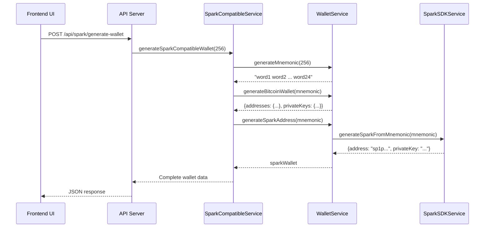

# MOOSH Wallet Seed Generation & Architecture Documentation

## 🏗️ System Architecture Overview

MOOSH Wallet implements a sophisticated multi-layer architecture for cryptocurrency wallet generation with full support for Bitcoin and Spark Protocol addresses.

```
┌─────────────────────────────────────────────────────────┐
│                    Frontend (Browser)                    │
│                  public/js/moosh-wallet.js               │
└─────────────────────┬───────────────────────────────────┘
                      │ HTTP/JSON
┌─────────────────────▼───────────────────────────────────┐
│                   API Server (Node.js)                   │
│              src/server/api-server.js:3001               │
└─────────────────────┬───────────────────────────────────┘
                      │
┌─────────────────────▼───────────────────────────────────┐
│                   Service Layer                          │
├──────────────────────────────────────────────────────────┤
│ sparkCompatibleService.js │ walletService.js │          │
│                          │                   │          │
│ sparkSDKService.js       │ sparkProtocolCompatible.js   │
└──────────────────────────────────────────────────────────┘
```

## 🔑 Core Components

### 1. API Server (`src/server/api-server.js`)

The Express.js server exposes RESTful endpoints for wallet operations:

- **POST `/api/spark/generate-wallet`** - Primary endpoint for new wallet generation
- **POST `/api/spark/import`** - Import existing wallet from mnemonic
- **GET `/api/balance/:address`** - Fetch address balance
- **GET `/api/transactions/:address`** - Fetch transaction history
- **GET `/health`** - Server health check

### 2. Service Layer Architecture

#### `sparkCompatibleService.js` (Orchestration Layer)
```javascript
// Main entry point for wallet generation
export async function generateSparkCompatibleWallet(strength = 256) {
    const mnemonic = generateMnemonic(strength);
    const bitcoinWallet = await generateBitcoinWallet(mnemonic, 'MAINNET');
    const sparkWallet = await generateSparkAddress(mnemonic);
    
    return {
        success: true,
        data: {
            mnemonic: mnemonic,  // String format (NOT array)
            addresses: {
                bitcoin: bitcoinWallet.addresses.segwit.address,
                spark: sparkWallet.address
            },
            privateKeys: {
                bitcoin: { 
                    wif: bitcoinWallet.addresses.segwit.wif,
                    hex: bitcoinWallet.addresses.segwit.privateKey
                },
                spark: { hex: sparkWallet.privateKey }
            },
            // Additional address types for Bitcoin
            bitcoinAddresses: {
                segwit: bitcoinWallet.addresses.segwit.address,
                taproot: bitcoinWallet.addresses.taproot.address,
                legacy: bitcoinWallet.addresses.legacy.address,
                nestedSegwit: bitcoinWallet.addresses.nestedSegwit?.address
            }
        }
    };
}
```

#### `walletService.js` (Core Wallet Operations)
Handles BIP39 mnemonic generation and Bitcoin address derivation:

```javascript
// BIP39 Mnemonic Generation
export function generateMnemonic(strength = 256) {
    return bip39.generateMnemonic(strength);
}

// Bitcoin Address Generation (BIP32/44/84)
export async function generateBitcoinWallet(mnemonic, network = 'MAINNET') {
    const seed = bip39.mnemonicToSeedSync(mnemonic);
    const root = bip32.fromSeed(seed);
    
    // Derivation paths
    const paths = {
        segwit: "m/84'/0'/0'/0/0",    // bc1q...
        taproot: "m/86'/0'/0'/0/0",   // bc1p...
        legacy: "m/44'/0'/0'/0/0",    // 1...
        nestedSegwit: "m/49'/0'/0'/0/0" // 3...
    };
    
    // Generate addresses for each type
    // Returns comprehensive wallet data
}
```

#### `sparkSDKService.js` (Spark Protocol Integration)
Manages Spark address generation with SDK fallback:

```javascript
// Primary Spark address generation
async function generateRealSparkWallet(network = 'MAINNET', mnemonic = null) {
    if (sdkAvailable) {
        // Use official @buildonspark/spark-sdk
        const { wallet, mnemonic } = await SparkWallet.initialize({
            mnemonic: mnemonic,
            options: { network: network }
        });
        
        const sparkAddress = await wallet.getSparkAddress();
        return { address: sparkAddress, mnemonic: mnemonic };
    } else {
        // Fallback implementation using bech32m
        return generateFallbackSparkAddress(mnemonic);
    }
}
```

## 🔐 Cryptographic Implementation Details

### Seed Generation Flow

1. **Entropy Generation**
   ```
   crypto.randomBytes(32) → 256 bits of entropy
   ```

2. **Mnemonic Creation (BIP39)**
   ```
   Entropy → SHA256 checksum → 24 words (or 12 for 128-bit)
   ```

3. **Seed Derivation**
   ```
   Mnemonic + Passphrase (empty) → PBKDF2 → 512-bit seed
   ```

4. **HD Key Derivation (BIP32)**
   ```
   Seed → Master Key → Child Keys (via derivation paths)
   ```

### Address Generation

#### Bitcoin Addresses
- **SegWit (bc1q...)**: BIP84 path m/84'/0'/0'/0/0
- **Taproot (bc1p...)**: BIP86 path m/86'/0'/0'/0/0
- **Legacy (1...)**: BIP44 path m/44'/0'/0'/0/0
- **Nested SegWit (3...)**: BIP49 path m/49'/0'/0'/0/0

#### Spark Addresses
- **Format**: `sp1p` + 62-64 characters (bech32m encoded)
- **Total Length**: 66 characters
- **Witness Version**: 1 (like Taproot)
- **Example**: `sp1pa68e8369dc9ba1736a9f63720b9c7a2b6bdf63afb2ed2afe9b9e27cd25e2c4`

### Private Key Formats

1. **WIF (Wallet Import Format)**
   ```
   [Network Byte][32-byte key][Compression Flag][4-byte checksum]
   Base58 encoded → L or K prefix for mainnet
   ```

2. **Hex Format**
   ```
   Raw 32-byte private key as hexadecimal string
   ```

## 📊 Data Flow Example

### New Wallet Generation Request



## 🎯 Response Structure

### Successful Wallet Generation Response
```json
{
    "success": true,
    "data": {
        "mnemonic": "cup you sheriff recall law brother gaze wreck enemy soul you cloth",
        "addresses": {
            "bitcoin": "bc1q6ytu3zkt77uvpgj40enntlnck3ezudpw5nhjhx",
            "spark": "sp1pa68e8369dc9ba1736a9f63720b9c7a2b6bdf63afb2ed2afe9b9e27cd25e2c4"
        },
        "privateKeys": {
            "bitcoin": {
                "wif": "L3xK9bTr2kG...",
                "hex": "cb16eed1fc767438..."
            },
            "spark": {
                "hex": "a68e8369dc9ba173..."
            }
        },
        "bitcoinAddresses": {
            "segwit": "bc1q6ytu3zkt77uvpgj40enntlnck3ezudpw5nhjhx",
            "taproot": "bc1p4gyalxyq9u9q4s92lnwtudkt5357crau6d26qmqnmlxjpkye7slqgm4dg3",
            "legacy": "14CMi5B7LPitdWheqeePrTN6dQEet5hV7m",
            "nestedSegwit": "3LoR5BHh1TVYVsMYL1daTNpytEeqpSsBYi"
        },
        "allPrivateKeys": {
            // Comprehensive private key data for all address types
        },
        "xpub": "xpub661MyMwAqRbcFe8NZX5uk1zGmjYdKkEaZxLhDiyScoHTFfRDUCKAE3TjMFXNeBDVWyR7KBXPsh2TuYM8H294cN7w4bLdcwL6cPt1vDWko7i",
        "wordCount": 24
    }
}
```

## 🛡️ Security Considerations

### 1. Server-Side Generation
- All cryptographic operations happen server-side
- Frontend never handles raw entropy or key derivation
- Reduces attack surface for browser-based exploits

### 2. Timing Characteristics
- **With SDK**: 10-60 seconds (includes SDK initialization)
- **Fallback**: < 1 second
- Frontend timeout: 60 seconds minimum

### 3. Module System
- Uses CommonJS for compatibility
- Avoids ES module conflicts with parent package.json
- Ensures reliable SDK loading

### 4. Entropy Source
- Uses Node.js `crypto.randomBytes()` 
- Cryptographically secure random number generation
- Never uses Math.random() or weak entropy

## 🔧 Configuration & Dependencies

### Required NPM Packages
```json
{
    "@buildonspark/spark-sdk": "^0.1.45",
    "bip32": "^2.0.6",
    "bip39": "^3.1.0",
    "bs58check": "^4.0.0",
    "tiny-secp256k1": "^2.2.3",
    "express": "^5.1.0",
    "cors": "^2.8.5"
}
```

### Environment Setup
1. API runs on port 3001
2. Frontend served on port 3333
3. CORS enabled for cross-origin requests
4. No authentication required (local development)

## 🚀 Deployment Notes

### Starting the System
```bash
# Start API Server
cd /path/to/MOOSH-WALLET
node src/server/api-server.js > api.log 2>&1 &

# Start Frontend Server
node src/server/server.js > server.log 2>&1 &
```

### Health Monitoring
- Check API: `curl http://localhost:3001/health`
- Check Frontend: `curl http://localhost:3333`

### Common Issues
1. **Module Loading Errors**: Ensure no parent package.json with `"type": "module"`
2. **SDK Not Found**: Fallback implementation will be used automatically
3. **Slow Generation**: Normal with SDK (10-60 seconds)

## 📝 Testing

### Test Wallet Generation
```bash
curl -X POST http://localhost:3001/api/spark/generate-wallet \
     -H "Content-Type: application/json" \
     -d '{"strength": 128}'
```

### Test Wallet Import
```bash
curl -X POST http://localhost:3001/api/spark/import \
     -H "Content-Type: application/json" \
     -d '{"mnemonic": "your twelve word mnemonic phrase here"}'
```

---

**Last Updated**: July 14, 2025  
**Version**: 1.0.0  
**Status**: Production Ready with SDK Fallback