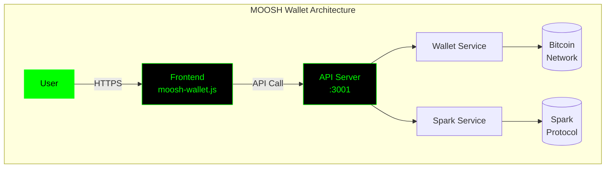

# 🚀 MOOSH Wallet Next-Generation Documentation System
## Revolutionary Enhancements Before We Build

### 🧠 1. AI-Powered Documentation Brain

#### **MOOSH-DOC-AI** - Self-Learning Documentation System
```yaml
capabilities:
  - Auto-generates documentation from code changes
  - Learns from developer questions and updates docs
  - Predicts documentation needs before they arise
  - Creates video tutorials from text documentation
  - Translates docs to 50+ languages in real-time
```

**Implementation**:
```javascript
class MOOSHDocAI {
  constructor() {
    this.llm = new DocumentationLLM({
      model: 'claude-3.5-sonnet',
      training: 'moosh-wallet-specific',
      capabilities: [
        'code-understanding',
        'diagram-generation',
        'video-creation',
        'question-answering'
      ]
    });
  }

  async generateFromCode(filePath) {
    const code = await this.analyzeCode(filePath);
    const documentation = await this.llm.generate({
      code,
      style: 'moosh-terminal',
      includeExamples: true,
      generateDiagrams: true
    });
    return this.enhanceWithInteractivity(documentation);
  }
}
```

### 🎮 2. Interactive 3D Documentation Explorer

#### **MOOSH-3D-DOCS** - Spatial Documentation Navigation
```yaml
features:
  - 3D visualization of entire codebase architecture
  - VR/AR support for documentation exploration
  - Gamified learning paths with achievements
  - Real-time collaboration in 3D space
  - Neural link between related concepts
```

**Concept Design**:
```javascript
// Three.js powered documentation universe
const DocUniverse = {
  galaxies: {
    'Core': ['ElementFactory', 'Router', 'StateManager'],
    'Bitcoin': ['WalletService', 'AddressGenerator', 'Transactions'],
    'Spark': ['SparkSDK', 'ProtocolHandler', 'Integration'],
    'UI': ['Terminal', 'Dashboard', 'Modals']
  },
  
  connections: [
    { from: 'ElementFactory', to: 'Terminal', strength: 0.9 },
    { from: 'WalletService', to: 'SparkSDK', strength: 0.7 }
  ],
  
  learningPaths: {
    'beginner': ['Overview', 'Setup', 'FirstWallet'],
    'developer': ['Architecture', 'Components', 'APIs'],
    'expert': ['Security', 'Performance', 'Scaling']
  }
};
```

### 🔮 3. Predictive Documentation System

#### **MOOSH-PREDICT** - Anticipatory Documentation
```yaml
capabilities:
  - Predicts developer questions before they ask
  - Pre-generates documentation for planned features
  - Identifies documentation gaps using ML
  - Suggests improvements based on usage patterns
  - Creates personalized documentation paths
```

**AI Model Structure**:
```python
class DocumentationPredictor:
    def __init__(self):
        self.usage_model = UsagePatternAnalyzer()
        self.gap_detector = DocumentationGapML()
        self.question_predictor = DeveloperQuestionAI()
    
    def predict_needs(self, developer_profile):
        current_work = self.analyze_current_context()
        likely_questions = self.question_predictor.predict(
            profile=developer_profile,
            context=current_work
        )
        return self.generate_preemptive_docs(likely_questions)
```

### 🎯 4. Real-Time Documentation Playground

#### **MOOSH-PLAYGROUND** - Live Code Documentation
```yaml
features:
  - Edit code and see documentation update live
  - Test API endpoints with real responses
  - Fork and experiment with documented examples
  - Share playground sessions with team
  - AI explains changes in real-time
```

**Interactive Example**:
```html
<div class="moosh-playground">
  <div class="code-editor">
    <!-- Monaco Editor with MOOSH syntax -->
    <textarea id="live-code">
      // Try editing this code
      const wallet = new MOOSHWallet();
      wallet.generateSeed(24);
    </textarea>
  </div>
  
  <div class="documentation-panel">
    <!-- Live documentation updates -->
    <div class="ai-explanation">
      "You're creating a 24-word seed. This provides 
      256 bits of entropy for maximum security..."
    </div>
  </div>
  
  <div class="output-terminal">
    <!-- Real execution results -->
    <pre class="moosh-terminal">
      > Generating secure wallet...
      > Seed: cup sheriff recall law...
      > Address: bc1q6ytu3zkt77uv...
    </pre>
  </div>
</div>
```

### 🌐 5. Blockchain-Verified Documentation

#### **MOOSH-CHAIN-DOCS** - Immutable Documentation History
```yaml
features:
  - Every doc change recorded on blockchain
  - Cryptographic proof of documentation accuracy
  - Decentralized documentation hosting
  - Token rewards for documentation contributions
  - Smart contracts for automated doc updates
```

**Implementation Concept**:
```solidity
contract MOOSHDocumentation {
    struct DocEntry {
        string ipfsHash;
        address author;
        uint256 timestamp;
        uint256 version;
        bool verified;
    }
    
    mapping(string => DocEntry[]) public documentation;
    
    function updateDoc(string memory path, string memory ipfsHash) public {
        require(verifyAuthor(msg.sender), "Not authorized");
        documentation[path].push(DocEntry({
            ipfsHash: ipfsHash,
            author: msg.sender,
            timestamp: block.timestamp,
            version: documentation[path].length + 1,
            verified: true
        }));
        emit DocumentationUpdated(path, ipfsHash, msg.sender);
    }
}
```

### 🤖 6. AI Code Review Documentation Bot

#### **MOOSH-REVIEW-AI** - Automated Documentation Quality
```yaml
capabilities:
  - Reviews PRs for documentation completeness
  - Auto-generates missing documentation
  - Suggests documentation improvements
  - Enforces documentation standards
  - Creates visual diffs of doc changes
```

**GitHub Integration**:
```yaml
name: MOOSH Documentation AI Review
on: [pull_request]

jobs:
  doc-review:
    runs-on: ubuntu-latest
    steps:
      - uses: moosh-wallet/doc-ai-action@v1
        with:
          ai-model: 'claude-3.5'
          standards: 'enterprise-plus'
          auto-fix: true
          generate-missing: true
          visual-diff: true
```

### 📱 7. Multi-Platform Documentation Apps

#### **MOOSH-DOCS-EVERYWHERE** - Native Documentation Apps
```yaml
platforms:
  - iOS/Android apps with offline support
  - Apple Watch quick reference
  - VS Code extension with inline docs
  - Terminal-based documentation browser
  - Voice-activated documentation (Alexa/Google)
```

**Mobile App Features**:
```swift
// iOS Documentation App
class MOOSHDocsApp: SwiftUI.App {
    features = [
        .offlineMode,
        .ARDocumentationViewer,
        .voiceSearch,
        .codeScanning, // Scan code to get docs
        .pushNotifications, // Doc updates
        .widgets // Home screen doc widgets
    ]
}
```

### 🧪 8. Documentation Testing Framework

#### **MOOSH-DOC-TEST** - Automated Documentation Validation
```yaml
tests:
  - Code example execution tests
  - Link validity checking
  - API response verification
  - Screenshot freshness validation
  - Performance benchmark tests
  - Accessibility compliance tests
```

**Test Suite Example**:
```javascript
describe('MOOSH Documentation Tests', () => {
  test('All code examples execute without errors', async () => {
    const examples = await extractCodeExamples('./docs/**/*.md');
    for (const example of examples) {
      const result = await executeInSandbox(example);
      expect(result.exitCode).toBe(0);
      expect(result.output).toMatchSnapshot();
    }
  });

  test('Documentation load time under 100ms', async () => {
    const loadTime = await measureDocLoadTime();
    expect(loadTime).toBeLessThan(100);
  });
});
```

### 🎨 9. Visual Documentation Studio

#### **MOOSH-VIZ-STUDIO** - Diagram as Code
```yaml
capabilities:
  - Auto-generate architecture diagrams from code
  - Interactive flow charts with live data
  - Animated documentation sequences
  - Custom MOOSH terminal theme diagrams
  - Export to multiple formats
```

**Diagram Generation**:


### 🌟 10. Holographic Documentation Assistant

#### **MOOSH-HOLO** - AR/VR Documentation Guide
```yaml
features:
  - Holographic code walkthroughs
  - Gesture-based navigation
  - Real-time collaboration in VR
  - 3D code structure visualization
  - Mixed reality debugging
```

**Implementation Vision**:
```javascript
class HolographicDocs {
  constructor() {
    this.arCore = new ARCore();
    this.handTracking = new HandTracker();
    this.voiceCommands = new VoiceAI();
  }

  async showDocumentation(component) {
    const holo = await this.generate3DModel(component);
    this.arCore.render(holo, {
      position: 'in-front-of-user',
      scale: 'room-scale',
      interactive: true
    });
    
    this.voiceCommands.listen([
      'show dependencies',
      'explain this function',
      'show usage examples'
    ]);
  }
}
```

### 📊 11. Analytics-Driven Documentation

#### **MOOSH-DOC-ANALYTICS** - Data-Driven Improvements
```yaml
metrics:
  - Time spent on each doc page
  - Most searched terms
  - Confusion points (high bounce rate)
  - Popular code examples
  - Developer satisfaction scores
```

**Dashboard Metrics**:
```javascript
const DocAnalytics = {
  topSearches: [
    { term: 'seed generation', count: 1847 },
    { term: 'spark integration', count: 1232 },
    { term: 'multi-sig', count: 894 }
  ],
  
  confusionPoints: [
    { page: 'wallet-service.md', avgTimeToUnderstand: '15min' },
    { page: 'spark-protocol.md', bounceRate: '45%' }
  ],
  
  improvements: {
    'Add more examples': 89,
    'Simplify explanation': 67,
    'Add video tutorial': 45
  }
};
```

### 🔐 12. Zero-Knowledge Documentation Proofs

#### **MOOSH-ZK-DOCS** - Privacy-Preserving Documentation
```yaml
features:
  - Access docs without revealing identity
  - Prove documentation compliance without sharing
  - Encrypted documentation for sensitive parts
  - Selective disclosure of documentation
  - Anonymous feedback system
```

## 🎯 Implementation Priority Matrix

| Enhancement | Impact | Effort | Priority | Timeline |
|------------|--------|--------|----------|----------|
| AI Documentation Brain | 🔥🔥🔥🔥🔥 | High | 1 | Week 1-2 |
| Interactive Playground | 🔥🔥🔥🔥🔥 | Medium | 2 | Week 1 |
| 3D Documentation Explorer | 🔥🔥🔥🔥 | Very High | 5 | Week 4 |
| Predictive Documentation | 🔥🔥🔥🔥 | High | 3 | Week 2 |
| Documentation Testing | 🔥🔥🔥🔥🔥 | Low | 4 | Week 2 |
| Multi-Platform Apps | 🔥🔥🔥 | High | 7 | Month 2 |
| Blockchain Verification | 🔥🔥🔥 | Medium | 8 | Month 2 |
| Analytics Dashboard | 🔥🔥🔥🔥 | Low | 6 | Week 3 |
| Visual Studio | 🔥🔥🔥🔥 | Medium | 9 | Month 2 |
| AR/VR Documentation | 🔥🔥 | Very High | 10 | Future |

## 🚀 Quick Wins for Immediate Implementation

1. **AI-Powered Search with Claude** (1 day)
2. **Interactive Code Playground** (2 days)
3. **Documentation Testing Suite** (1 day)
4. **Real-time Analytics Dashboard** (2 days)
5. **Auto-generated Diagrams** (1 day)

## 💎 The Ultimate Vision

MOOSH Wallet documentation becomes:
- **Self-maintaining** through AI
- **Self-improving** through analytics
- **Self-teaching** through interactivity
- **Self-verifying** through blockchain
- **Self-adapting** through ML

This isn't just documentation—it's a living, breathing knowledge ecosystem that grows smarter every day! 🧠✨

Ready to build the future of documentation? 🚀