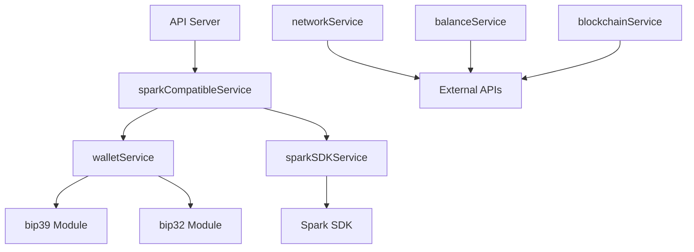

# MOOSH Wallet Service Layer Architecture

## Overview

The MOOSH Wallet backend service layer is built using ES modules and provides a comprehensive set of services for Bitcoin and Spark Protocol operations. The architecture follows a modular design pattern with clear separation of concerns.

## Service Categories

### 1. Core Wallet Services
- **walletService.js** - Primary wallet operations (BIP39, HD wallets)
- **sparkSDKService.js** - Spark Protocol SDK integration
- **sparkCompatibleService.js** - UI compatibility layer

### 2. Blockchain Services
- **blockchainService.js** - Blockchain interaction layer
- **balanceService.js** - Balance fetching and management
- **networkService.js** - Network status and fee estimation

### 3. Specialized Services
- **cryptoWalletService.js** - Cryptographic operations
- **deterministicWalletService.js** - HD wallet derivation
- **secureWalletService.js** - Security-focused operations

### 4. Protocol-Specific Services
- **sparkProtocolService.js** - Spark Protocol operations
- **sparkAddressService.js** - Spark address generation
- **sparkWalletService.js** - Spark wallet management

### 5. Utility Services
- **bip39Words.js** - BIP39 wordlist management
- **mockWalletService.js** - Testing and development
- **simpleBalanceService.js** - Simplified balance queries

## Service Dependencies



## Common Patterns

### 1. Error Handling
All services follow a consistent error handling pattern:
```javascript
try {
    // Operation logic
    return { success: true, data: result };
} catch (error) {
    console.error('Service error:', error);
    return { success: false, error: error.message };
}
```

### 2. Module Imports
Services use ES module syntax:
```javascript
import crypto from 'crypto';
import { generateMnemonic } from './walletService.js';
export { myFunction };
```

### 3. Response Formats
Standardized response structure:
```javascript
{
    success: boolean,
    data: object | null,
    error: string | null,
    timestamp: ISO 8601 string
}
```

### 4. Network Support
Services support both mainnet and testnet:
- MAINNET: Production Bitcoin/Spark network
- TESTNET: Test network for development

## Security Considerations

1. **Private Key Handling**
   - Never log private keys
   - Clear from memory after use
   - Use secure random generation

2. **API Security**
   - No hardcoded credentials
   - Environment variable configuration
   - Request validation

3. **Cryptographic Operations**
   - Use crypto.randomBytes() not Math.random()
   - Proper entropy for key generation
   - Secure mnemonic generation

## Performance Optimization

1. **Caching Strategy**
   - 30-second cache for network data
   - Balance caching with TTL
   - Fee estimate caching

2. **Parallel Operations**
   - Promise.all for concurrent requests
   - Async/await for clean code
   - Error boundary handling

3. **Resource Management**
   - Connection pooling
   - Request timeouts
   - Memory cleanup

## Testing Approach

1. **Unit Tests**
   - Individual service testing
   - Mock external dependencies
   - Test error conditions

2. **Integration Tests**
   - Service interaction testing
   - API endpoint testing
   - Network simulation

3. **Performance Tests**
   - Response time monitoring
   - Memory usage tracking
   - Concurrent request handling

## Deployment Considerations

1. **Environment Variables**
   - BITCOIN_NETWORK (mainnet/testnet)
   - API_TIMEOUT (request timeout)
   - CACHE_TTL (cache duration)

2. **Service Health**
   - Health check endpoints
   - Service status monitoring
   - Error rate tracking

3. **Scaling Strategy**
   - Stateless service design
   - Horizontal scaling ready
   - Load balancer compatible

## Future Enhancements

1. **Planned Services**
   - Lightning Network integration
   - Ordinals/Inscriptions support
   - Multi-signature wallets

2. **Performance Improvements**
   - Redis caching layer
   - Database integration
   - WebSocket real-time updates

3. **Security Enhancements**
   - HSM integration
   - Multi-factor authentication
   - Advanced encryption options